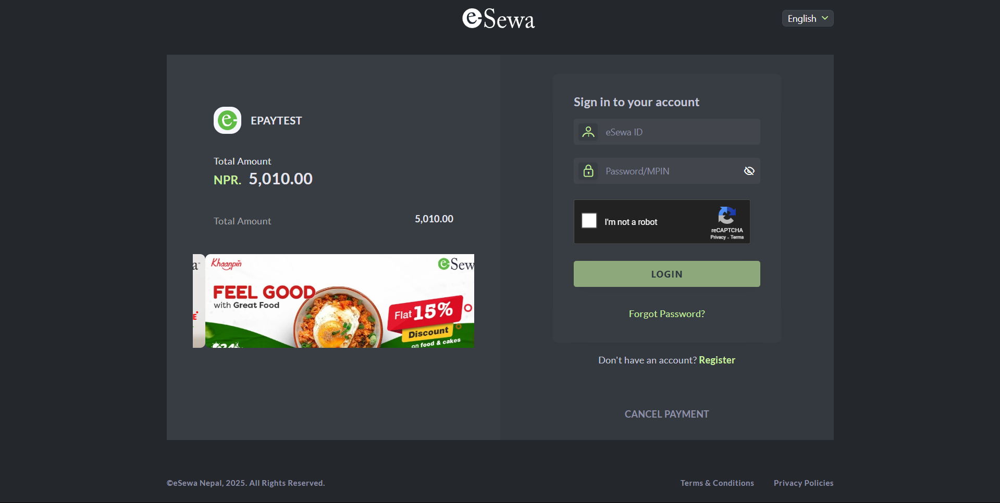
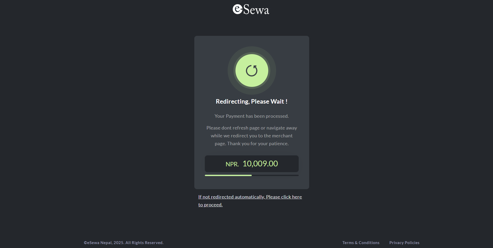
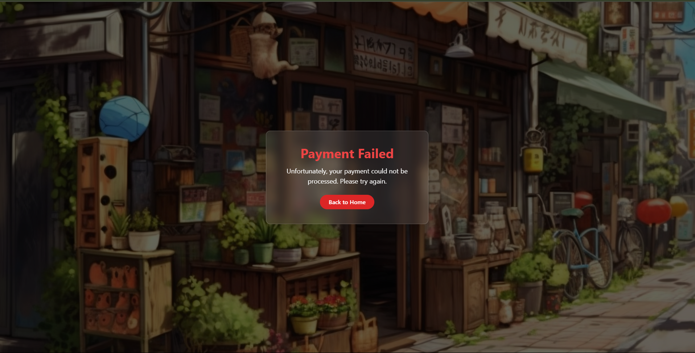
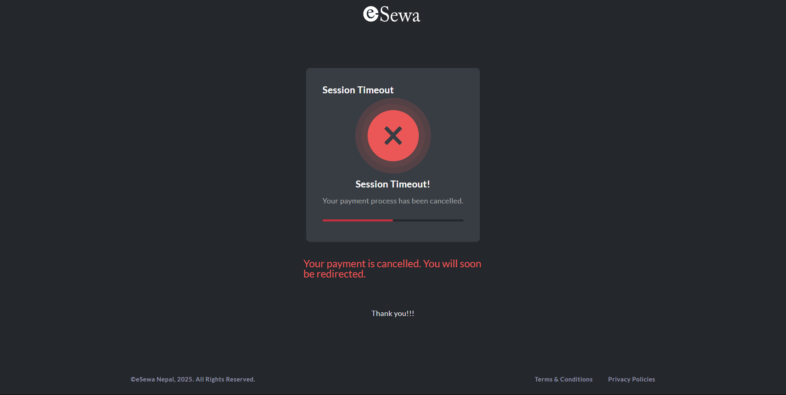

# Chill-Store 🛒

Welcome to **Chill-Store**, an e-commerce platform built for a smooth and modern shopping experience. This project includes both frontend and backend implementations, supporting product listings, image uploads, and payment processing via **eSewa**.

---

## 🔧 Tech Stack

### Frontend:
- **React** – for building a responsive UI
- **Tailwind CSS** – for modern, utility-first styling
- **Recoil** – for state management

### Backend:
- **Node.js** – runtime environment
- **Express** – web framework for handling routes and API logic
- **Multer** – for handling file uploads (images)
- **MongoDB** – NoSQL database to store products and user data

### Payments:
- **eSewa** – integrated as the payment gateway

---

## 📸 Screenshots

### 1. Landing Page  


### 2. Login Page  


### 3. Seller Dashboard  


### 4. Home Page  


### 5. Profile Page  


### 6. Cart Page  


### 7. Esewa Payment


### 8. Payment success


### 9. Redirection after success


### 10. Payment failure


### 11. Redirection after failure



---

## 🚀 Features

- Product browsing and filtering  
- User authentication  
- Add to cart & checkout flow  
- Image upload for product listings (via Multer)  
- eSewa payment integration  
- Fully responsive design with Tailwind  

---

## 📦 Setup Instructions

1. Clone the repository:

   ```bash
   git clone https://github.com/viperofficailll/Chill-Store.git
   cd Chill-Store
